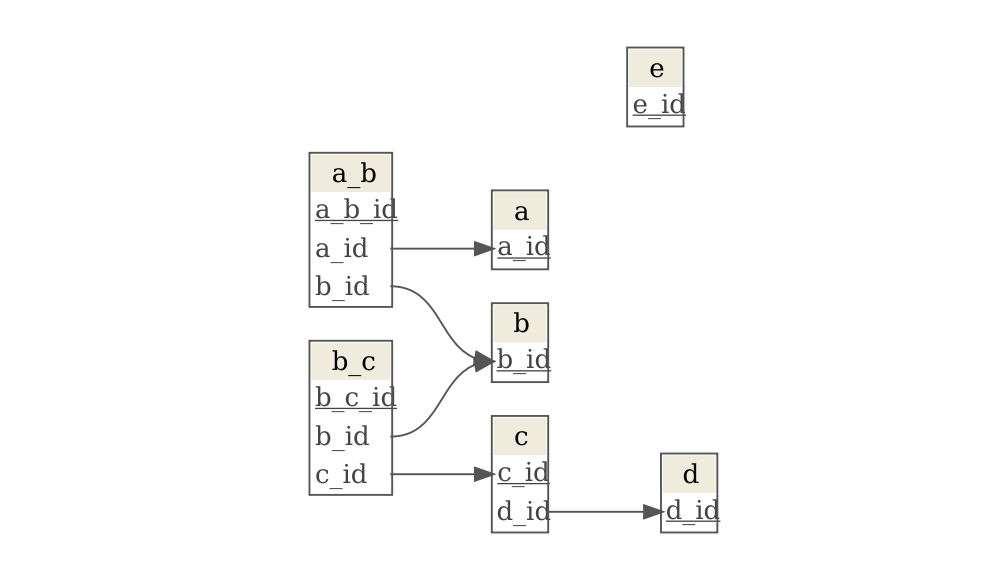

<!-- README.md is generated from README.Rmd. Please edit that file -->

# adm

<!-- badges: start -->
<!-- badges: end -->

The goal of adm is to **a**utomate **d**ata **m**odels created with the
[dm](https://CRAN.R-project.org/package=dm) package. It guesses primary
and foreign keys assuming the names of the tables and keys follow three
rules:

1.  For each table, the primary key has the same name as the table with
    the prefix `_id`. For example the table `x` has a primary key named
    `x_id`.

2.  If an `_id` column exists in a table which name is different than
    the prefix of that `_id` column, then that column is a foreign key
    linking to another table. For example, in the table `x_id`, the
    column `y_id` is a foreign key linking to the table `y`.

3.  If a table links two other tables, its name contains the names of
    those tables. For example, the table `x_y` links the tables `x` and
    `y`.

This is hard work up-front but but makes programming much easier so for
for complex databases it pays off.

## Installation

You can install the development version of adm from
[GitHub](https://github.com/) with:

``` r
# install.packages("devtools")
devtools::install_github("maurolepore/adm")
```

## Example

``` r
library(dm, warn.conflicts = FALSE)
library(adm)

adm_example <- adm_demo()
```

Consider this data model. It has the “adm” structure but no keys:

``` r
# Removing keys
dm <- dm(!!!as.list(adm_example))
dm
#> ── Metadata ────────────────────────────────────────────────────────────────────
#> Tables: `a`, `a_b`, `b`, `b_c`, `c`, … (7 total)
#> Columns: 17
#> Primary keys: 0
#> Foreign keys: 0
```

-   `add_keys()` adds the keys.

``` r
adm <- dm |> add_keys()
adm
#> ── Metadata ────────────────────────────────────────────────────────────────────
#> Tables: `a`, `a_b`, `b`, `b_c`, `c`, … (7 total)
#> Columns: 17
#> Primary keys: 7
#> Foreign keys: 5

adm |> dm::dm_draw()
```


-   `flatten_linked_tables()` flattens all linked tables in a single
    one.

``` r
adm |> flatten_linked_tables()
#> Joining with `by = join_by(b_id, b)`
#> # A tibble: 1 × 10
#>    a_id     a a_b_id  b_id     b b_c_id  c_id     c  d_id     d
#>   <dbl> <dbl>  <dbl> <dbl> <dbl>  <dbl> <dbl> <dbl> <dbl> <dbl>
#> 1     1     1      1     1     1      1     1     1     1     1
```

### Without adm

You can do the same directly with the [dm](https://dm.cynkra.com/)
package, but in complex databases it’s hard work.

-   Add keys.

``` r
dm2 <- dm |> 
  dm_add_pk(a, a_id) |> 
  dm_add_pk(a_b, a_b_id) |> 
  dm_add_pk(b, b_id) |> 
  dm_add_pk(b_c, b_c_id) |> 
  dm_add_pk(c, c_id) |> 
  dm_add_pk(d, d_id) |> 
  dm_add_pk(e, e_id) |> 
  dm_add_fk(a_b, a_id, a) |> 
  dm_add_fk(a_b, b_id, b) |> 
  dm_add_fk(b_c, b_id, b) |> 
  dm_add_fk(b_c, c_id, c) |> 
  dm_add_fk(c, d_id, d)
dm2
#> ── Metadata ────────────────────────────────────────────────────────────────────
#> Tables: `a`, `a_b`, `b`, `b_c`, `c`, … (7 total)
#> Columns: 17
#> Primary keys: 7
#> Foreign keys: 5

dm2 |> dm_draw()
```



-   Flatten.

``` r
flat1 <- dm2 |> dm_flatten_to_tbl(.start = a_b)
flat2 <- dm2 |> dm_flatten_to_tbl(.start = b_c, .recursive = TRUE)
left_join(flat1, flat2)
#> Joining with `by = join_by(b_id, b)`
#> # A tibble: 1 × 10
#>   a_b_id  a_id  b_id     a     b b_c_id  c_id     c  d_id     d
#>    <dbl> <dbl> <dbl> <dbl> <dbl>  <dbl> <dbl> <dbl> <dbl> <dbl>
#> 1      1     1     1     1     1      1     1     1     1     1
```
